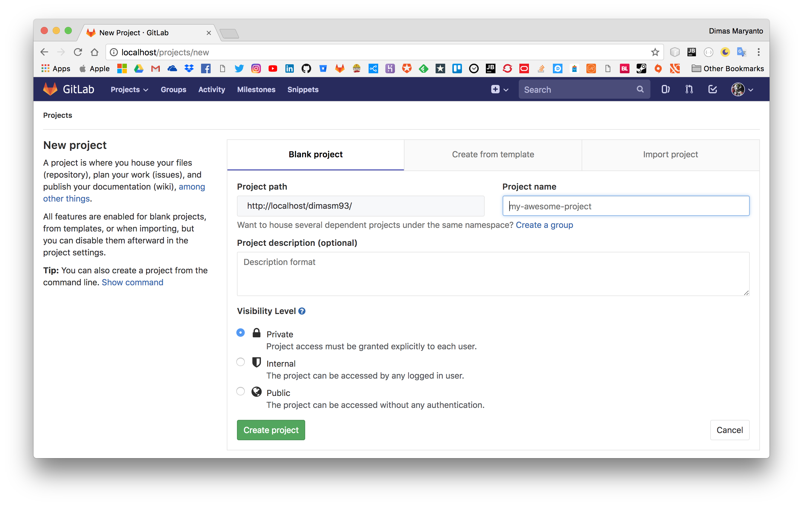
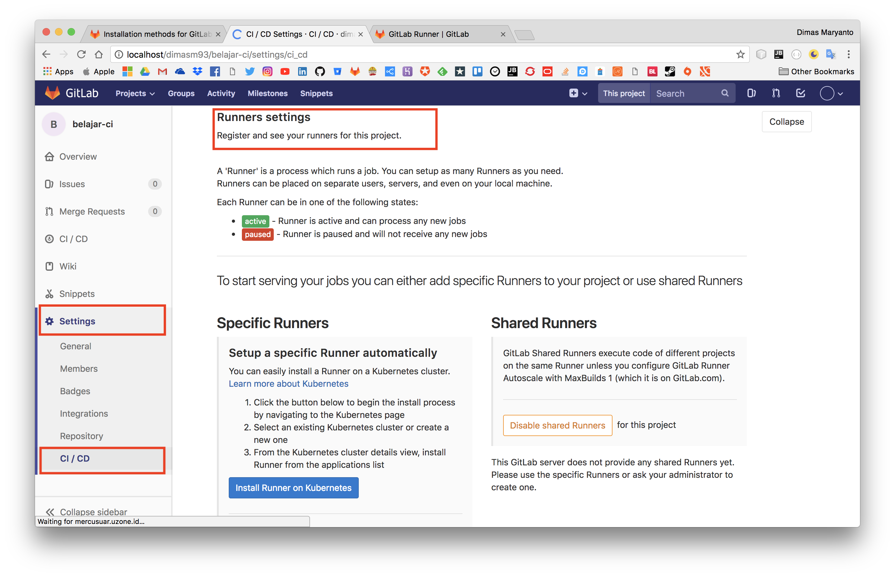
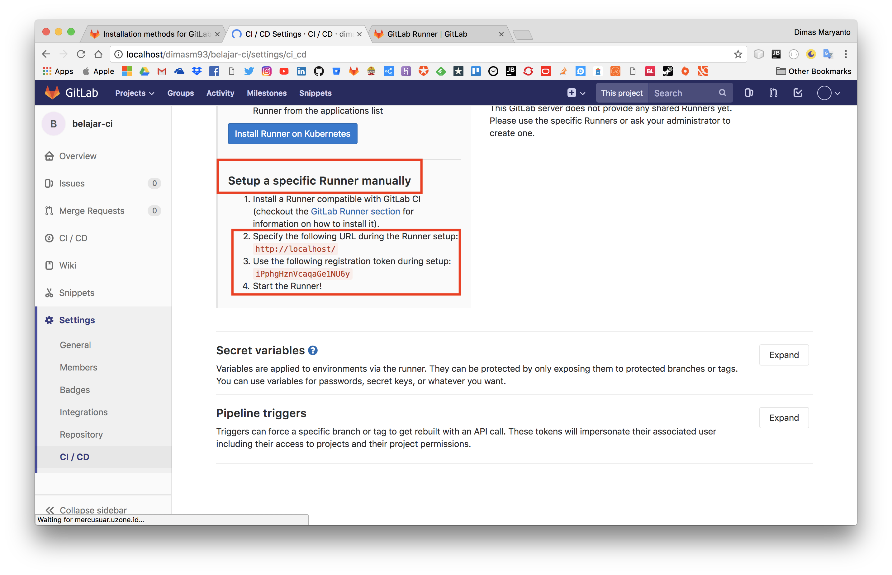

# Automation Deployment

Melakukan automation untuk deployment, atau lebih sering disebut continues integration and continues development. Untuk melakukan semua itu ada beberapa teknologi yang kita bisa gunakan seperti berikut:

- GUI Based
    - Jenkins
    - [Jetbraint TeamCity](https://www.jetbrains.com/teamcity)
- Script Based
    - Gitlab CI
    - Github CI
    - Bitbucket

## Run gitlab on docker-compose

Karena saya mau menggunakan `gitlab-ci` jadi saya menggunakan docker untuk menginstall dockernya, run gitlab containernya menggunakan perintah `docker-compose up` setelah installasi gitlab dalam docker container selesai anda bisa masuk ke gitlabnya di link [http://localhost](http://localhost:80) kemudian masukan password untuk root gitlab klo saya pake `adminroot`.


## Buat repository di gitlab

Sama halnya seperti kita mau menggunakan version control sistem seperti github, bitbucket klo kita mau pake hosting version control kita harus buat repositorynya dulu, ok langsung aja buat. Tapi pertama harus login dulu dengan user yang telah kita buat. Setelah itu buat seperti berikut:



tambahkan remote repository ke project yang telah kita buat seperti berikut:

```bash 
git remote add origin http://localhost/dimasm93/belajar-ci.git
```

Setelah ditambahkan kemudian di push ke remote repository, dengan perintah seperti berikut:

```bash 
git push -u origin master

```

## Intall Gitlab Runner

Untuk menginstall gitlab-runner, kita membutuhkan virtual machine atau host kita sendiri. cara installnya bisa dilihat di [website resminya](https://docs.gitlab.com/runner/)

Sekarang kita register repository kita ke gitlab-runner dengan melihat dulu tokennya di repository contohya seperti berikut:





Selelah itu baru kita gunakan command berikut:

```bash
gitlab-runner register

# 1. input host gitlab repository contohnya http://192.168.1.61
# 2. masukan token dari repository contohnya iPphgHznVcaqaGe1NU6y
# 3. biarkan setinggan default langsung enter ja
# 4. Setelah itu gitlab-runner kita harus tentukan pilihan mau connection lewat ssh, docker, dll kita pilih ja ssh
# 5. Setelah itu kasih aja informasi alamat vps atau server kita seperti host, username, port ssh, password 
```


