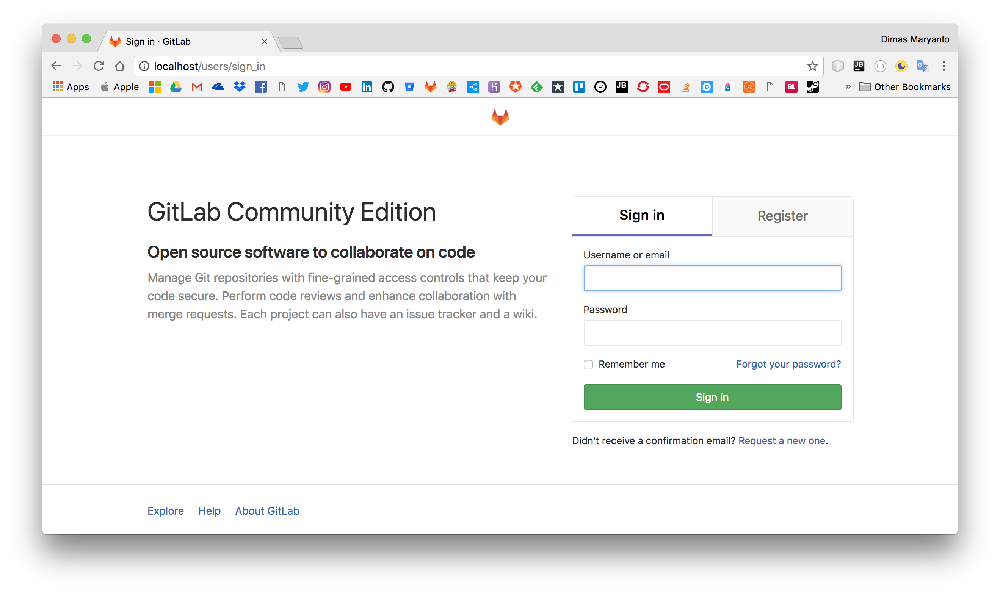

# Automation Deployment

Melakukan automation untuk deployment, atau lebih sering disebut continues integration and continues development. Untuk melakukan semua itu ada beberapa teknologi yang kita bisa gunakan seperti berikut:

- GUI Based
    - Jenkins
    - [Jetbraint TeamCity](https://www.jetbrains.com/teamcity)
- Script Based
    - Gitlab CI
    - Github CI
    - Bitbucket

## Run gitlab on docker-compose

Karena saya mau menggunakan `gitlab-ci` jadi saya menggunakan docker untuk menginstall dockernya, run gitlab containernya menggunakan perintah `docker-compose up` setelah installasi gitlab dalam docker container selesai anda bisa masuk ke gitlabnya di link [http://localhost](http://localhost:80) kemudian masukan password untuk root gitlab klo saya pake `adminroot`.

